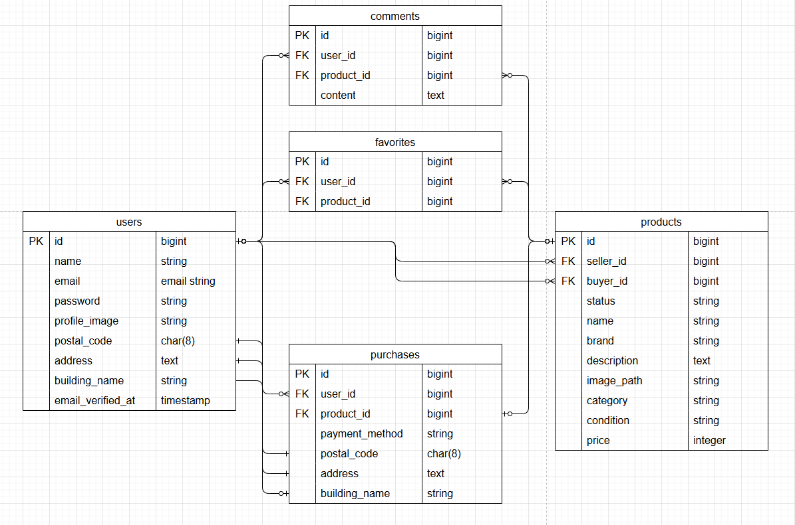

# 模擬案件1
Laravelによる商品出品・購入・コメント・お気に入り・メール認証機能を備えた模擬ECアプリケーションです。

## 環境構築手順
プロジェクト直下に.envを作成
touch .env

.envに以下を記述（UID/GIDはホストOSのユーザーIDに合わせて設定）
UID=1000
GID=1000

プロジェクト直下のgitignoreの修正,以下を追記
.env
docker/mysql/data/

Docker ビルド 
docker-compose up -d --build

## コンテナ操作
PHPコンテナに入る 
docker-compose exec php bash

Composer インストール 
composer install

## Laravel初期設定
.env 作成 
cp .env.example .env

アプリキー生成 
php artisan key:generate

シンボリックリンク作成
php artisan storage:link

マイグレーション
php artisan migrate

ダミーデータ作成
php artisan db:seed

テストコマンド
php artisan test --env=testing
php artisan test --filter=LoginTest

PHPコンテナから出る　Ctrl+D

## ダミーデータ仕様

ダミーデータユーザー情報（3名）
name:kiwi
email:kiwi@example.com
password:password
出品数:5
購入数:0
お気に入り:5
コメント:1(ノートPC)
メール認証済み

name:orange
email:orange@example.com
password:password
出品数:5
購入数:1(腕時計)
お気に入り:2
コメント:1(ノートPC)
メール未認証

name:watermelon
email:watermelon@example.com
password:password
出品数:0
購入数:0
お気に入り:10
コメント:1(腕時計)
メール未認証
住所未登録

新規登録用簡易データ
name:melon
email:melon@example.com
password:password

## 主なルート一覧
本プロジェクトのルート構成（URL・メソッド・ミドルウェア）は、別途提出するスプレッドシートに記載しています。  
レビュー担当者はそちらをご参照ください。

## 動作確認URL一覧
ログイン画面表示:http://localhost/login
商品一覧画面：http://localhost
MySQL画面：http://localhost:8080
mailhog認証画面：http://localhost:8025/

### MailHogのメール認証手順
1. 新規ユーザー登録を行う（例：`melon@example.com`）
2. メール認証誘導画面に遷移、「認証はこちらから」のボタンをクリック
3. 以下のURLから MailHog にアクセスするので、メール内容を確認してください  
   👉 [http://localhost:8025](http://localhost:8025)
4. メール本文内の「メール認証リンク」または「Verify Email Address」をクリックすると、認証が完了し、初回はプロフィール設定画面に遷移します

仕様環境
PHP: 8.4.8 (CLI)
Laravel Framework: 8.83.8 (LTS)
MySQL: 8.0.26
nginx: 1.21.1
mailhog

ER図

## 補足
- MailHogはローカル開発用のSMTPキャプチャツールです。メールは実際には送信されません。
- UID/GIDはLinux環境で `id` コマンドにより確認可能です。
- ER図は設計の参考用です。実装と完全一致しない場合があります。
